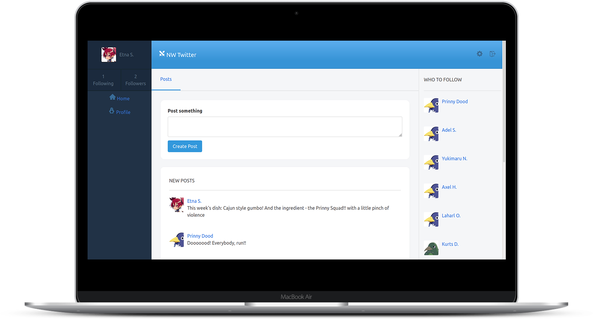

# NW Twitter

> This website is a social media MVP project built on Ruby on Rails and PostgreSQL based on Twitter UI redesign proposed by [Gregoire Vella](https://www.behance.net/gallery/14286087/Twitter-Redesign-of-UI-details) on Behence. Live demo available on Heroku.



## Built With

- Ruby 3
- Ruby on Rails 6
- PostgreSQL
- Cloudinary API
- Devise
- Shoulda Matchers
- Capybara
- Rspec

## Live version

You can check the live version in [this link](http://nwtwitter.herokuapp.com/)

## Getting Started

To get a local copy up and running follow these simple example steps.

### Prerequisites

- Ruby on Rails v 6.x. For more information on how to install Ruby on Rails, please follow this [link](https://guides.rubyonrails.org/getting_started.html)

- Make sure you have PostgreSQL installed on your machine. For more information on how to set it up please follow [this tutorial](https://www.digitalocean.com/community/tutorials/how-to-install-and-use-postgresql-on-ubuntu-18-04)

### Setup and Install

- Clone this repository using the link above (click on the 'code' button)
- Open a terminal and `cd` to the cloned repository
- Run `bundle install` to install ruby gems required the dependencies
- Run `yarn` to install javascript required the dependencies
- Run `bin/rails db:create` to create database
- Run `bin/rails db:migrate` to migrate the database

### Usage

- Run `bin/rails server` to start the server
- Enter output address from your terminal on your browser to access the page, for instance:
```terminal
 Listening on http://127.0.0.1:3000
```

### Tests

To run the tests, move to the root folder of the project and enter the following command:
```terminal
  $ bundle exec rspec
```

## Authors

👤 **Gustavo Carvalho**

- GitHub: [@gscarv13](https://github.com/gscarv13)
- Twitter: [@Gscarv13](https://twitter.com/Gscarv13)
- LinkedIn: [Gustavo Carvalho](www.linkedin.com/in/gscarv13)

## 🤝 Contributing

Contributions, issues, and feature requests are welcome!

Feel free to check the [issues page](https://github.com/gscarv13/twitter-redesign/issues).

## Show your support

Give a ⭐️ if you like this project!

## 📝 License

This project is [MIT](LICENSE) licensed.
